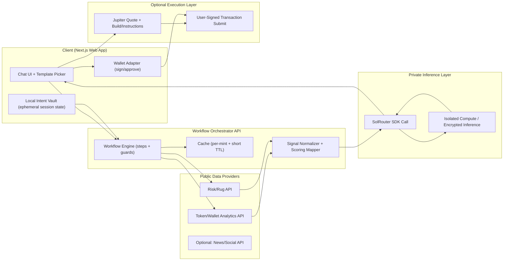
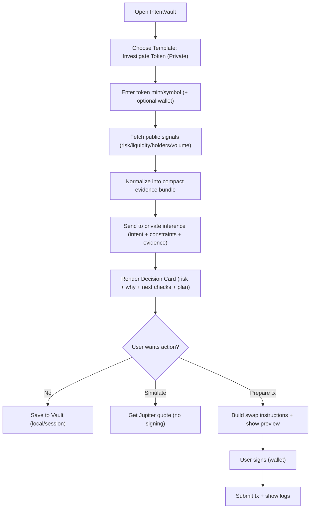
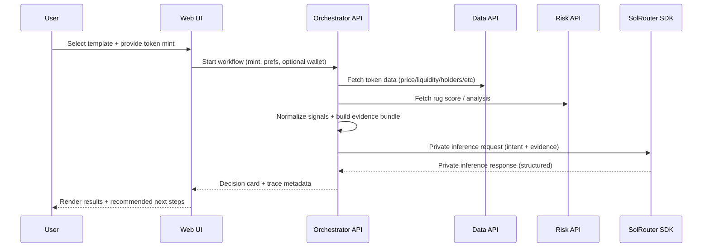
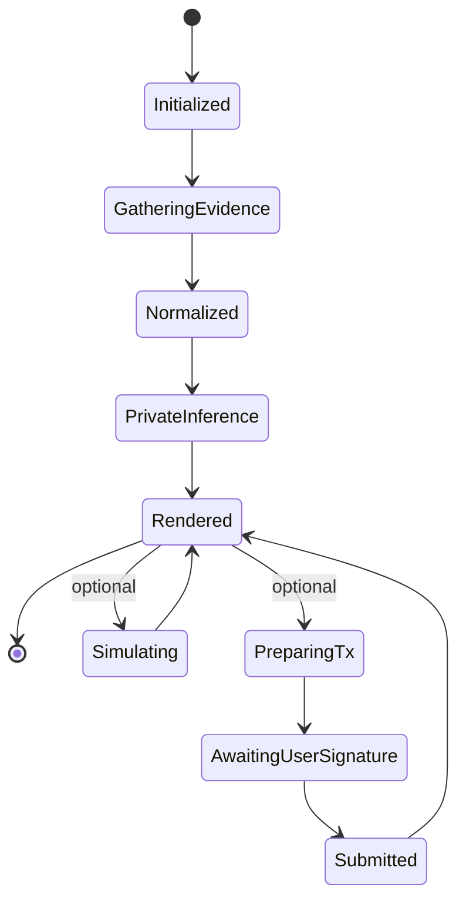
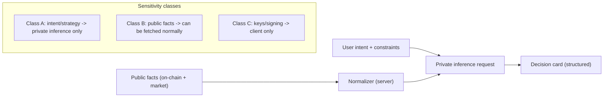

# IntentVault Roadmap PRD

## Context and product thesis

IntentVault is a **product-layer “private workflow” wrapper** that turns SolRouter-style private inference into something users can actually adopt: repeatable templates, structured outputs, and (later) agent actions and paid tools—without rebuilding existing infrastructure.

This PRD assumes the following about SolRouter based on **public sponsor/partner statements** rather than direct access to the official docs site (the docs endpoint was not fetchable from this environment at the time of writing). SolRouter has publicly claimed that (a) prompts are encrypted client-side before leaving the browser, (b) an SDK is available for developers, and (c) it supports agent workflows (including MCP support) and integrates with orchestration platforms (e.g., OpenServ). citeturn6search11turn6search15turn13search9

The “why now” is real and measurable: agentic systems expand the attack surface from “bad answers” to “bad outcomes,” and security guidance is rapidly evolving around risks like goal hijacking, tool misuse, identity/privilege abuse, memory poisoning, and supply-chain compromise of tools/plugins. OWASP’s Top 10 for Agentic Applications (2026) exists specifically to capture these new agent failure modes. citeturn20search0turn20search2

In the Solana memecoin context, the environment is adversarial: large-scale fraud and rug-pull patterns are widely discussed, and multiple “rug score” and token-scanning services already exist. citeturn11search14turn21search1turn9search1  
That’s the key strategic constraint for IntentVault:

- **Do not compete with scanners / RPC infrastructure / routing engines.**
- **Do** orchestrate them into a private decision workflow where *intent* and *strategy* are protected.

## Product definition and user experience

IntentVault is not “a private token checker.” It is a **workflow layer** that can host multiple decision templates over time. The MVP ships with **one** template that is easy to demo, clearly privacy-relevant, and fast to implement using existing services.

**Core product promise (MVP):**  
Users can run a “token investigation” workflow where public on-chain/market facts are collected from third-party APIs, but the *user’s intent, constraints, and strategy reasoning* are processed via private inference—so the sensitive part (what they’re planning) isn’t exposed to public AI endpoints. citeturn6search11turn6search15turn20search0

**Interface principle:** “Chat UI with guardrails.”  
A chat-like UI is familiar, but the product should default the user into **structured prompts** via templates. The Vercel open-source Next.js chatbot template is a strong base to fork because it already solves streaming UX, chat memory scaffolding, and modern UI composition with Next.js + shadcn/ui. citeturn15search7turn15search8

**MVP workflow (one template): “Investigate Token (Private)”**
- Input: token mint address or symbol; optional wallet address; preference knobs (risk mode, time horizon).
- System: pulls public signals (risk score, liquidity, holders, volume, etc.) from existing APIs; sends a structured bundle + user intent to private inference; returns a structured “decision card.”
- Output includes: Trust / Risk score summary, top risk factors, what to verify next, and a “plan suggestion” (safe/balanced/aggressive) with disclaimers.
- Optional (demo only): “Prepare swap simulation” using Jupiter quote + build instructions but requires explicit wallet signature to execute. (This stays in roadmap unless you already have bandwidth.) citeturn0search3turn0search1

**Non-goals for MVP (explicit):**
- No autonomous trading loops.
- No auto-signing; always user-signed with wallet adapter.
- No claims of “private payments” on Solana; Confidential Transfer is currently unavailable on mainnet and devnet due to audit/disablement of the ZK ElGamal program, so this should not be positioned as a near-term deliverable. citeturn19search0

## System architecture and data flows

This section defines the system as components and trust boundaries, then shows concrete flows. The architecture is intentionally modular: you can swap data providers, swap the UI shell, and add payments later without rewriting the core.

**High-level components**
- Client Web App: Next.js UI, template selector, chat + structured forms, local state, wallet interaction.
- Workflow Orchestrator API: thin server (Next.js route handlers or separate Node service) that:
  - calls third-party data APIs
  - normalizes signals
  - routes private inference requests to SolRouter SDK
  - returns structured output + citations/trace metadata
- Data Providers (public facts):
  - Token & wallet analytics API provider(s) (e.g., Solana Tracker Data API or similar). citeturn9search0turn9search2
  - Rug/risk scoring provider(s) (e.g., DeFade API v1 endpoints). citeturn21search1
- Optional execution providers:
  - Jupiter Swap API for quotes + swap instructions/build flow. citeturn0search3turn0search1
- Wallet interface:
  - Solana Wallet Adapter for browser wallet connection; major wallets support Wallet Standard and thus can work without per-wallet adapters in many cases. citeturn8search0turn8search1
- Future paid-tool layer:
  - x402 for pay-per-call tool access over HTTP using 402 Payment Required flow. citeturn7search0turn7search8
  - MCPay as an optional open-source wrapper for adding x402 payments to MCP servers/tools. citeturn7search6turn7search15

**Existing assets you should reuse or fork**
- UI shell: Vercel’s open-source AI chatbot template repo can be forked to get chat UX and streaming mechanics fast. citeturn15search7
- Token + wallet data for agents: the SolTracker MCP server (MIT-licensed) shows how to expose Solana Tracker endpoints via MCP for LLM tooling; even if you don’t ship MCP in MVP, it’s a roadmap accelerant and reference implementation. citeturn11search10turn9search0
- Risk API: DeFade provides an API with endpoints like `/v1/rug-score/:mint` and `/v1/analyze/:mint`, plus example response structures you can map into your own normalized schema. citeturn21search1

### Architecture diagram

**Why the split matters:** public data collection is not what needs privacy; *intent and strategy reasoning* do. Your system should treat “facts” and “intent” as different sensitivity classes, and only route what’s sensitive through private inference. citeturn20search0turn6search11

### User workflow flowchart

### Core sequence for MVP

## Technical specification for development

This section translates the architecture into concrete build choices, repository structure, data models, and interfaces. It is designed to be “agent-friendly” so a builder can implement it without ambiguity.

**Recommended stack**
- Frontend: Next.js App Router (TypeScript), fork Vercel chatbot template for the fastest path to a polished chat UI. citeturn15search7turn15search0
- UI library: shadcn/ui for composable, editable components (keeps the UI “open code” and easy to modify). citeturn15search8
- Backend: Next.js Route Handlers (for MVP) or a dedicated Node service if you want clean separation.
- Storage:
  - MVP: ephemeral sessions only (in-memory / browser local state).
  - Phase expansion: Postgres for chat/workflow history (the Vercel template shows one approach), but keep sensitive content minimized and/or encrypted client-side. citeturn15search7
- Solana client libraries:
  - Prefer the modern Solana Kit stack (`@solana/kit`, `@solana/client`) for new work, and use `@solana/web3-compat` if you need legacy web3.js surfaces. citeturn8search6turn8search7turn12search0
  - Wallet connection via wallet adapter (React hooks). citeturn8search0
- Swap simulation/execution:
  - Jupiter Swap API v2 for assembled tx flows or `/swap-instructions`/`/build` for custom instruction assembly. citeturn0search3turn0search1

**Repo structure (suggested)**
- `apps/web/` – Next.js UI (forked base)
- `apps/web/app/api/workflow/` – Orchestrator endpoints
- `packages/workflows/` – Workflow definitions (pure TS, testable)
- `packages/providers/` – Data provider clients (Solana Tracker, DeFade, etc.)
- `packages/schemas/` – zod schemas for all inputs/outputs
- `packages/security/` – policy engine + redaction + audit helpers

**Workflow engine design**
A workflow is a deterministic **state machine** with explicit steps. This makes security and debugging easier than “freeform agents.”

**Inputs (MVP)**
- `tokenQuery`: string (mint address or ticker symbol)
- `riskMode`: `"safe" | "balanced" | "aggressive"`
- `timeHorizon`: `"short" | "mid" | "long"`
- `walletContext?`: string (public key, optional)
- `privacyMode`: always private in MVP (remove the toggle until you have a clear product reason)

**Normalized evidence bundle (MVP)**
You should constrain data volume and keep it machine-readable. The goal is predictable inference.

Example fields (illustrative, not provider-specific):
- token identity: mint, symbol, name
- liquidity USD, market cap USD, top holders concentration
- risk score and top contributing factors
- recent volume windows (5m/1h/24h)
- authority flags (mint authority, freeze authority, LP lock/burn if known)
- “source map” metadata (which provider returned what)

**Decision card output schema (MVP)**
Return a structured object; UI renders it as cards + collapsible detail.

Minimum fields:
- `overallRisk`: `"low" | "medium" | "high"`
- `score`: 0–100
- `topRisks`: array of `{label, evidence, severity}`
- `whatToVerifyNext`: array of steps
- `strategyOptions`: `{safe, balanced, aggressive}` each with:
  - `summary`
  - `entryPlan`
  - `exitPlan`
  - `positionSizingHint`
- `disclaimer`: string (“not financial advice”)
- `trace`: request id(s), timestamps, provider ids

**Third-party provider adapter specs**
- Solana Tracker:
  - supports token info, risk objects, and metrics (docs show token endpoints returning token/pools/risk/etc). citeturn9search6turn9search0
- DeFade:
  - provides a rug score endpoint and a full analysis endpoint plus a documented JSON response shape. citeturn21search1

**Devnet funding integration (bounty relevance)**
If your MVP includes any on-chain transaction demo (even “send 1 USDC” or “simulate a swap”), Circle’s faucet can supply devnet USDC with a clearly stated limit of **20 USDC per pairing every 2 hours**, and Circle documents Solana devnet USDC transfers using Solana Kit. citeturn12search8turn12search0

## Security, privacy, and trust boundaries

This is the most important section to get right for a “private workflow layer” product. It also becomes the strongest differentiator in your bounty submission narrative.

**Threat model baseline**
You are building an agent-like workflow wrapper, so you must assume:
- Indirect prompt injection (untrusted web/social content influencing the model) is a persistent risk in agentic systems. citeturn20search0turn20news50turn20news53
- Tool misuse and identity/privilege abuse become high-impact once tools can execute transactions or act with user identity. citeturn20search0turn20search2
- Supply chain risk exists in third-party packages and “skills/tools,” especially as ecosystems standardize around MCP-like tool servers. citeturn20search1turn20news55

**Privacy design principles**
- Default to private inference for sensitive components (intent, constraints, strategy).
- Treat public chain/market data as non-sensitive, but do not casually merge it with user identity context unless necessary.
- Minimize storage:
  - MVP: no server-side chat history.
  - Later: if you store, encrypt client-side (or store only hashed summaries and keep the raw private).

**Trust boundaries**
- Data providers can see what you request (mint address), but they do not need to see the user’s strategy prompt.
- Private inference layer should not receive raw API keys or signing keys.
- Wallet signing happens client-side only.

**Execution safety**
If/when you add execution:
- Use Solana preflight simulation and explicit confirmation status checks; Solana’s `sendTransaction` behavior makes it clear that “RPC accepted the tx” is not the same as “the network confirmed it,” so your UX must show status properly. citeturn20search6
- Use versioned transactions (v0) when account lists get large; Solana’s docs explain v0 + address lookup tables as the standard solution to packet size constraints. citeturn18search0turn18search2

**What not to promise**
- Do not promise “private payments on Solana” as a near-term deliverable: Solana’s Confidential Transfer extension is currently unavailable because the ZK ElGamal program is temporarily disabled on mainnet and devnet during audit, and even when available it hides amounts/balances but not token account addresses. citeturn19search0

**Agent governance and policy layer (recommended for Phase expansion)**
Microsoft’s open-source Agent Governance Toolkit is explicitly positioned as a runtime security governance layer for autonomous agents, addressing OWASP agentic risks via policy enforcement and integrations across common frameworks. Even if you don’t adopt it directly, it provides a useful blueprint for how to articulate guardrails: permissions, tool gating, audit trails, and deterministic enforcement. citeturn4search4

## Roadmap and milestones

This roadmap is intentionally detailed and written in “handoff-ready” language. Each phase has scope, deliverables, acceptance criteria, and recommended reuse.

### MVP phase

**Scope**
- Ship a single workflow: “Investigate Token (Private)”
- Chat UI + template selector
- One or two data providers integrated (choose fast, stable APIs)
- Private inference integration via SolRouter SDK
- Demo artifacts: working repo, setup README, screenshots/loom

**Deliverables**
- Web UI:
  - Chat thread
  - Template picker (left sidebar or dropdown)
  - Decision card renderer (structured, not a blob)
- Orchestrator:
  - Workflow step engine + trace output
  - Provider adapters:
    - Solana Tracker token endpoint OR DeFade rug score endpoint (or both)
- Private inference adapter:
  - A single function to call SolRouter SDK with:
    - compact evidence bundle
    - user constraints
    - output schema requirements
- Observability:
  - basic request IDs
  - provider timing
  - cache hit/miss
- Bounty-specific operational steps:
  - include devnet USDC faucet instructions (Circle) if you demonstrate any devnet activity. citeturn12search8turn12search0

**Acceptance criteria**
- “Investigate Token” returns a complete decision card in under a target latency (define a goal; measure it; show it in README).
- No secrets in logs.
- Wallet keys never touch the server.
- The repo runs from a clean install with deterministic steps.

**Recommended reuse**
- Fork Vercel’s open-source chatbot template to avoid spending time on chat UX scaffolding. citeturn15search7
- Use a ready API like DeFade or Solana Tracker rather than building your own scanners. citeturn21search1turn9search0

### Expansion phase

**Scope**
- Multiple workflows (still “decision workflows,” not autonomous execution)
- Session persistence with privacy controls
- “Evidence transparency”: show which data sources contributed to which claim

**Deliverables**
- Workflow library:
  - “Compare two tokens”
  - “Portfolio risk snapshot” (wallet public key input)
- Better evidence pipeline:
  - concurrency + retry logic
  - provider fallback strategy
  - stricter normalization
- Storage:
  - optional server-side storage for non-sensitive artifacts (e.g., template usage stats)
  - encrypted client-side vault export/import (local-first pattern)

**Acceptance criteria**
- Each workflow produces deterministic structured output.
- Tool outputs have rate limits and caching.
- Clear UI distinction between “facts” and “model reasoning.”

### Payments phase

**Scope**
- Monetize “tools,” not “chat.”
- Add pay-per-call access to premium endpoints (either your own or partner tools)

**Deliverables**
- x402 buyer support:
  - the system can call a priced endpoint, handle 402 Payment Required, and retry with payment headers per x402 flow. citeturn7search0turn7search8
- Optional MCP server packaging:
  - expose IntentVault “tools” over MCP
  - optionally wrap them with MCPay to add on-chain pay-per-call to MCP tooling citeturn7search6turn7search15turn7search3
- Pricing model:
  - per workflow run
  - per premium signal
  - per “evidence bundle refresh”

**Acceptance criteria**
- Payment flows are opt-in and transparent.
- No private inference content is exposed in payment metadata.

### Execution phase

**Scope**
- Add transaction preparation and user-signed execution for limited actions (start with “swap simulation,” then “prepare tx,” then “execute with confirmation”)
- Keep execution policy-driven and safe

**Deliverables**
- Jupiter integration:
  - quote fetching
  - building swap instructions / transactions
  - clear preview UI of slippage + expected output citeturn0search3turn0search1
- Wallet-gated execution:
  - require signature for every tx at first
  - optional “session approvals” later (time-bound, scoped permissions)
- Chain status:
  - show confirmation states properly (do not treat “sent” as “done”) citeturn20search6

**Acceptance criteria**
- No autonomous trading loops without explicit gating.
- Every action logs a local audit trail.
- Users can revoke permissions instantly.

## Build plan, PRD appendices, and diagrams pack

This final section contains a compact “handoff checklist” and additional diagrams you can copy into tickets.

**Implementation checklist (MVP)**
- Fork UI base (Next.js chatbot template) and strip it down to:
  - no auth
  - no database requirement
  - one template workflow citeturn15search7
- Add provider clients:
  - Solana Tracker (token endpoint) citeturn9search6
  - DeFade rug-score endpoint citeturn21search1
- Add workflow orchestrator:
  - step runner + typed context object
  - caching + timeout + retries
- Add SolRouter adapter:
  - single function call
  - enforce structured output schema
- Add UI renderer:
  - decision card component
  - evidence disclosure component

**Diagram pack**
The following diagram is intended for onboarding devs/agents to the “what is private / what is public” rule set:

**Notes on “private payments” positioning**
If investors/founders push for “private payments,” keep it accurate: Solana’s Confidential Transfer extension is currently unavailable on mainnet and devnet due to the ZK ElGamal program being disabled during audit; plan it as a future exploration, not a near-term commitment. citeturn19search0turn19search8