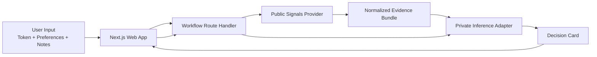
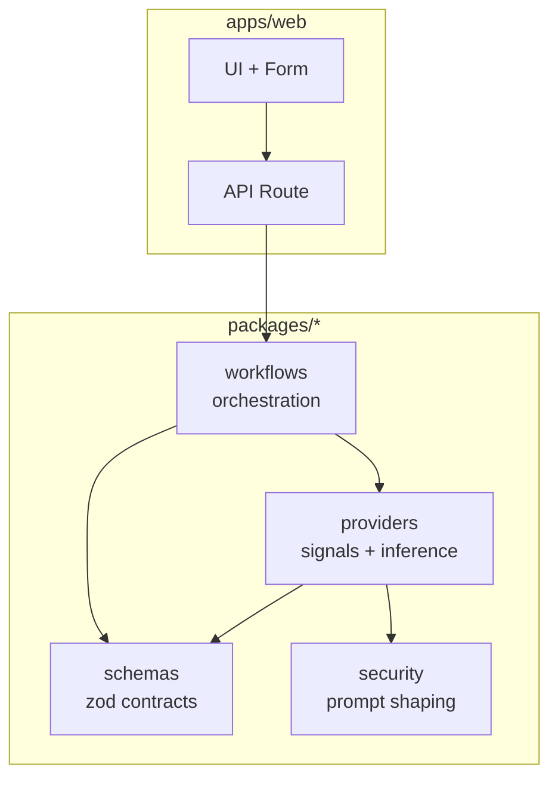

# IntentVault

IntentVault is a privacy-first workflow layer for Solana decision support.

The product thesis is simple: public market facts can be gathered from normal APIs, but a user's intent, constraints, and strategy should not be casually exposed to a public AI endpoint. IntentVault separates those two concerns and turns them into a structured workflow instead of a loose chat prompt.

The current MVP implements one workflow:

- `Investigate Token (Private)`

It collects public token signals, normalizes them into a compact evidence bundle, sends the sensitive reasoning step through a private inference adapter, and returns a structured decision card.

## What It Does

- Accepts a token mint or symbol, risk mode, time horizon, and optional wallet context
- Builds a normalized evidence bundle from public-signal providers
- Shapes private user notes and constraints separately from public facts
- Produces a structured decision card with risk summary, next checks, and strategy options
- Runs locally in deterministic mock mode even when no external API keys are configured

## Why It Exists

Most crypto tooling gives you one of two things:

- raw public metrics
- generic chat interfaces

IntentVault is meant to sit above both. It is not a scanner, router, or RPC provider. It is a workflow wrapper that makes private decision support repeatable, inspectable, and safe to extend.

## How It Works



## Request Flow

1. The user submits the `Investigate Token (Private)` form in the web app.
2. The route handler starts the workflow with typed input validation.
3. A public-signal provider returns token, holder, liquidity, and risk-related facts.
4. The workflow normalizes those facts into a predictable evidence bundle.
5. Private notes and constraints are shaped separately and passed to the inference adapter.
6. The app returns a structured decision card instead of an unstructured model blob.

## Privacy Model

- Public facts are fetched outside the private boundary.
- User notes, intent, and constraints belong only in the inference step.
- Wallet signing is not part of the current MVP.
- The current build stores no server-side chat history.

## Current Architecture



Package responsibilities:

- `apps/web`: UI and HTTP route handlers
- `packages/schemas`: shared request, evidence, and decision-card contracts
- `packages/workflows`: deterministic workflow orchestration
- `packages/providers`: public-signal and inference adapters, including SolRouter
- `packages/security`: redaction and private prompt shaping helpers
- `docs/architecture.md`: deeper architecture notes and boundaries
- `STATUS.md`: current project state and next steps

## Current Runtime Modes

### Public Signals

- `mock`: deterministic local evidence generation

### Inference

- `auto`: uses SolRouter when `SOLROUTER_API_KEY` is present, otherwise falls back to mock inference
- `mock`: always use deterministic local decision-card generation

## What Is In Scope Right Now

- Structured token investigation UI
- Shared schema contracts across app and workflow layers
- Mock public-signal mode for local development
- Optional SolRouter integration behind an adapter boundary
- Typed workflow tests

## What Is Explicitly Out of Scope Right Now

- Wallet signing
- Autonomous execution
- Database persistence
- Claims of private on-chain payments

## Local Development

```bash
npm install
cp .env.example .env.local
npm run dev
```

Open `http://localhost:3000`.

## Environment

- `INTENTVAULT_SIGNALS_MODE=mock`
- `INTENTVAULT_INFERENCE_MODE=auto`
- `SOLROUTER_API_KEY=` optional
- `SOLROUTER_MODEL=gpt-oss-20b`
- `SOLROUTER_BASE_URL=` optional override

## Scripts

```bash
npm run dev
npm run typecheck
npm run test
npm run build
```

## Current Status

See [STATUS.md](./STATUS.md) for the current implementation state and the next recommended slices.
